# youth-aviation-contest-platform 部署手册

本文档面向首次在阿里云环境部署本项目的同学，按 `ECS + Docker Compose + MySQL + Redis + OSS` 的推荐方案整理。若只想快速查环境变量或 Nginx 配置，可配合阅读 [ecs-single-node-docker.md](./ecs-single-node-docker.md)。

## 1. 部署前说明

- 推荐架构：`1 台 ECS + Docker Compose + 1 个 OSS Bucket`
- 应用默认监听端口：`3000`
- 存储模式：
  - `oss`：推荐生产环境使用，浏览器直传 OSS
  - `local`：适合内网或临时演示环境，文件落到 Docker 卷
- 建议 ECS 与 OSS 使用同地域，便于走内网端点

## 2. 新建 ECS 实例

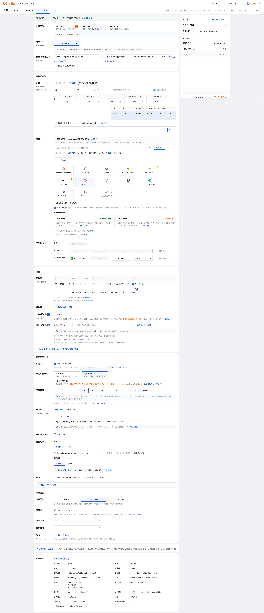

建议：

- 系统选择 `Ubuntu 22.04` 或 `Ubuntu 24.04`
- 实例规格按并发量选择，初期中小规格即可
- 如后续使用 OSS，ECS 地域尽量与 OSS Bucket 一致

## 3. 安全组开放端口

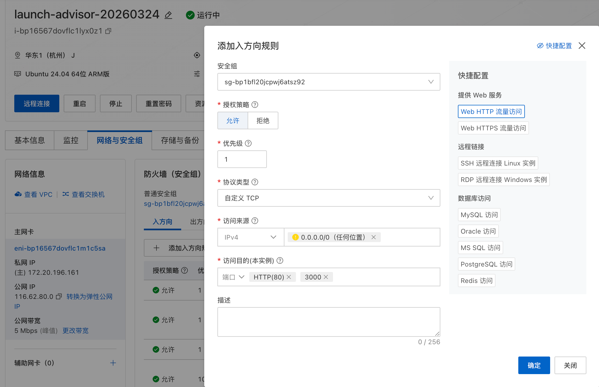

最少建议放行：

- `22/tcp`：SSH 登录
- `80/tcp`：HTTP
- `443/tcp`：HTTPS

调试阶段可临时放行：

- `3000/tcp`：直接访问 Node 应用

正式上线后，建议只保留 `80/443`。当前仓库默认拓扑是宿主机 `nginx` 监听公网入口，再反向代理到容器内 `127.0.0.1:3001`。

## 4. 准备 OSS 资源

如果部署使用 `local` 模式，可以跳过本节。

### 4.1 购买 OSS 资源包


### 4.2 创建 Bucket

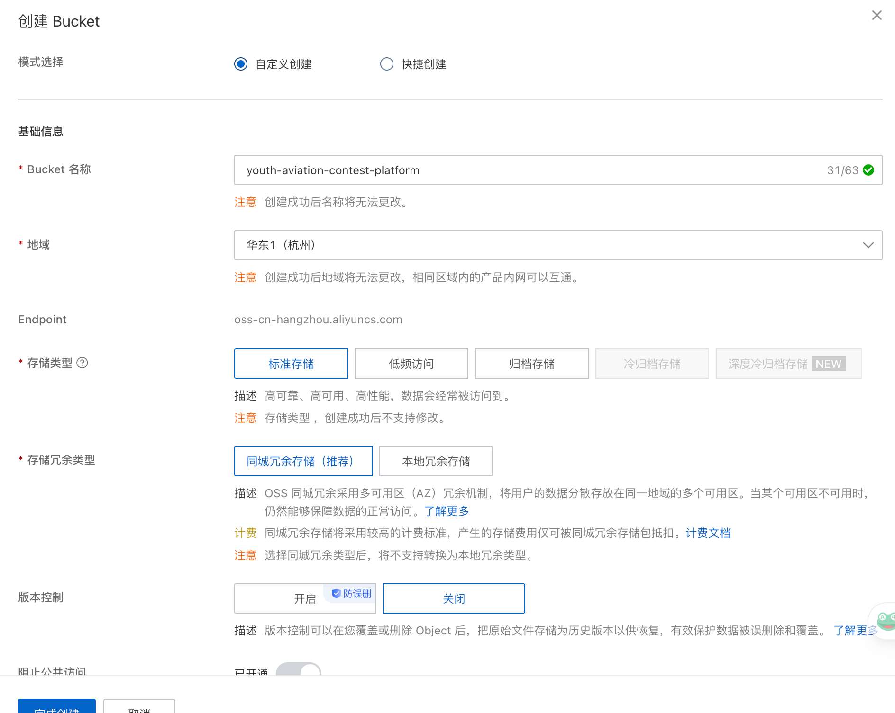

创建完成后，记录以下信息：

- `BucketName`
- `OSS_REGION`，例如 `oss-cn-hangzhou`
- `OSS_ENDPOINT`，公网端点
- `OSS_INTERNAL_ENDPOINT`，内网端点

常见公网端点格式：

```text
https://oss-cn-hangzhou.aliyuncs.com
```

常见内网端点格式：

```text
https://oss-cn-hangzhou-internal.aliyuncs.com
```

### 4.3 创建 RAM 用户并生成 AccessKey

#### 4.3.1 进入 RAM 控制台

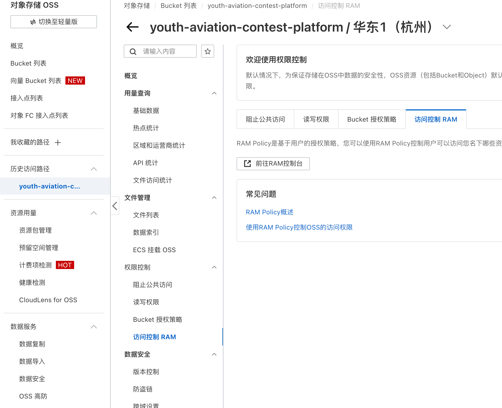

#### 4.3.2 创建用户

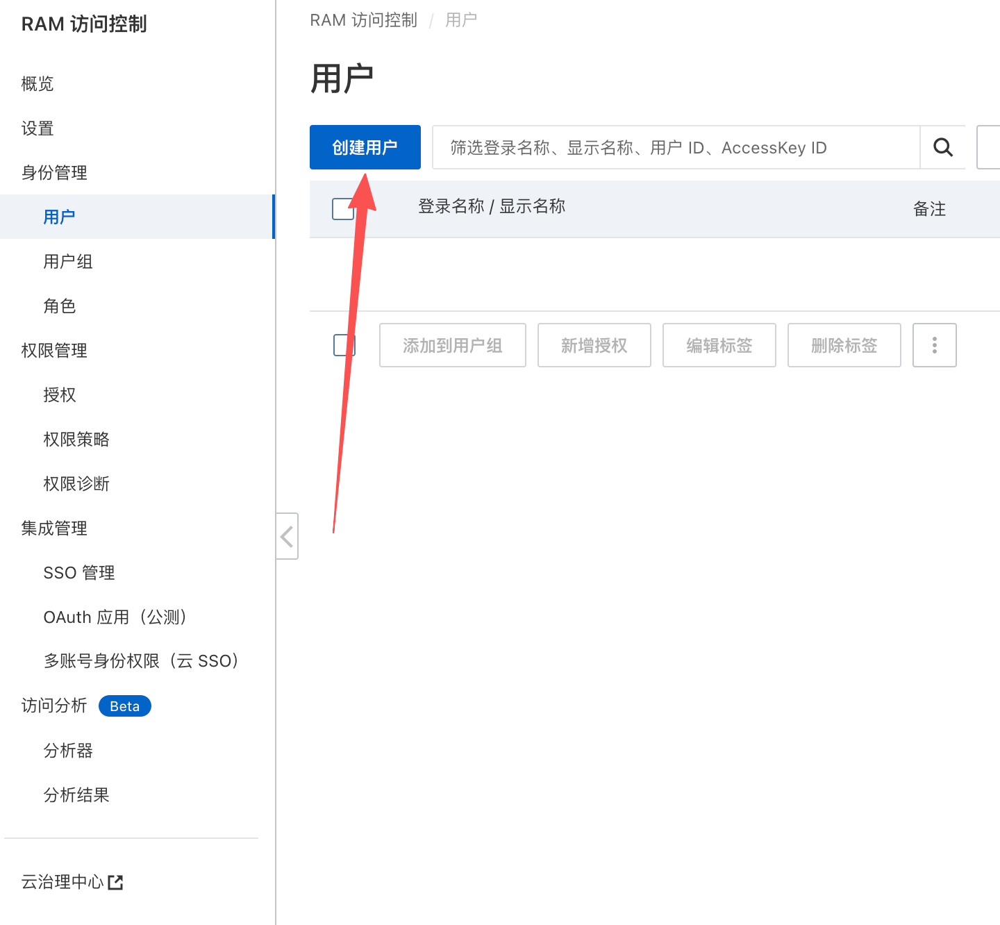

#### 4.3.3 配置用户信息

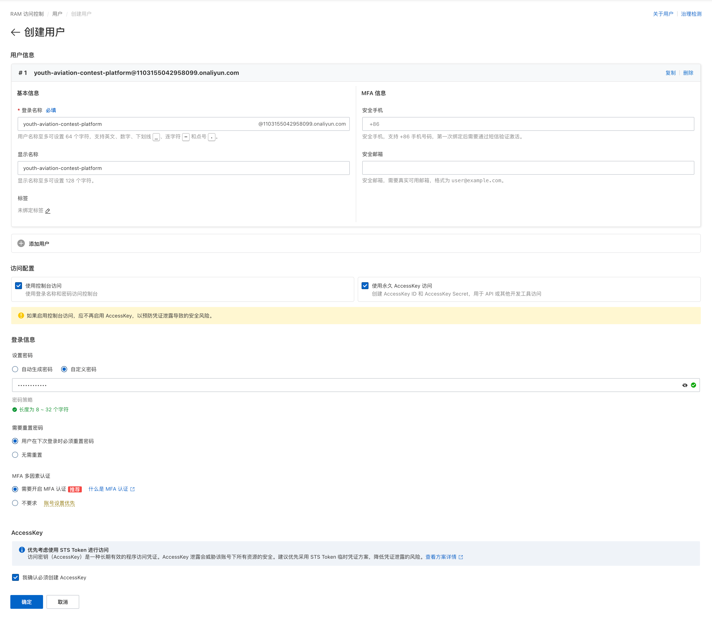

创建完成后，记录：

- `AccessKey ID`
- `AccessKey Secret`

它们分别对应 `.env.production` 中的：

- `OSS_ACCESS_KEY_ID`
- `OSS_ACCESS_KEY_SECRET`

#### 4.3.4 增加用户授权

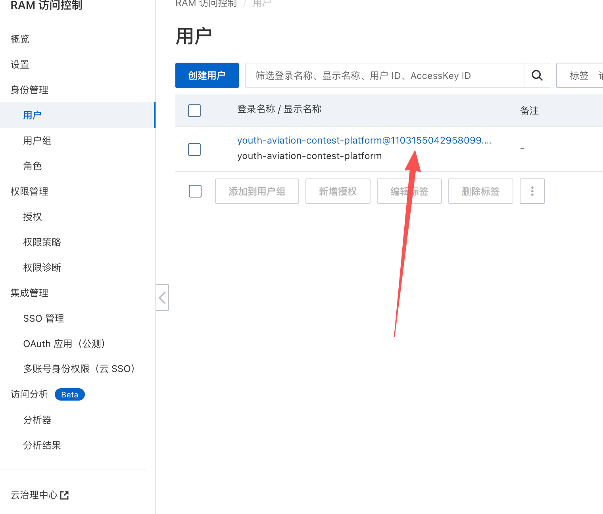

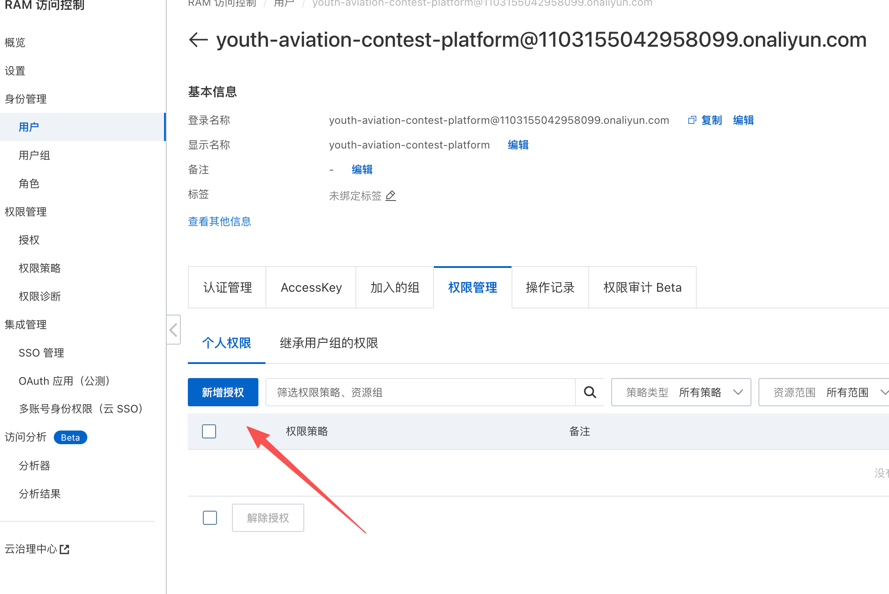

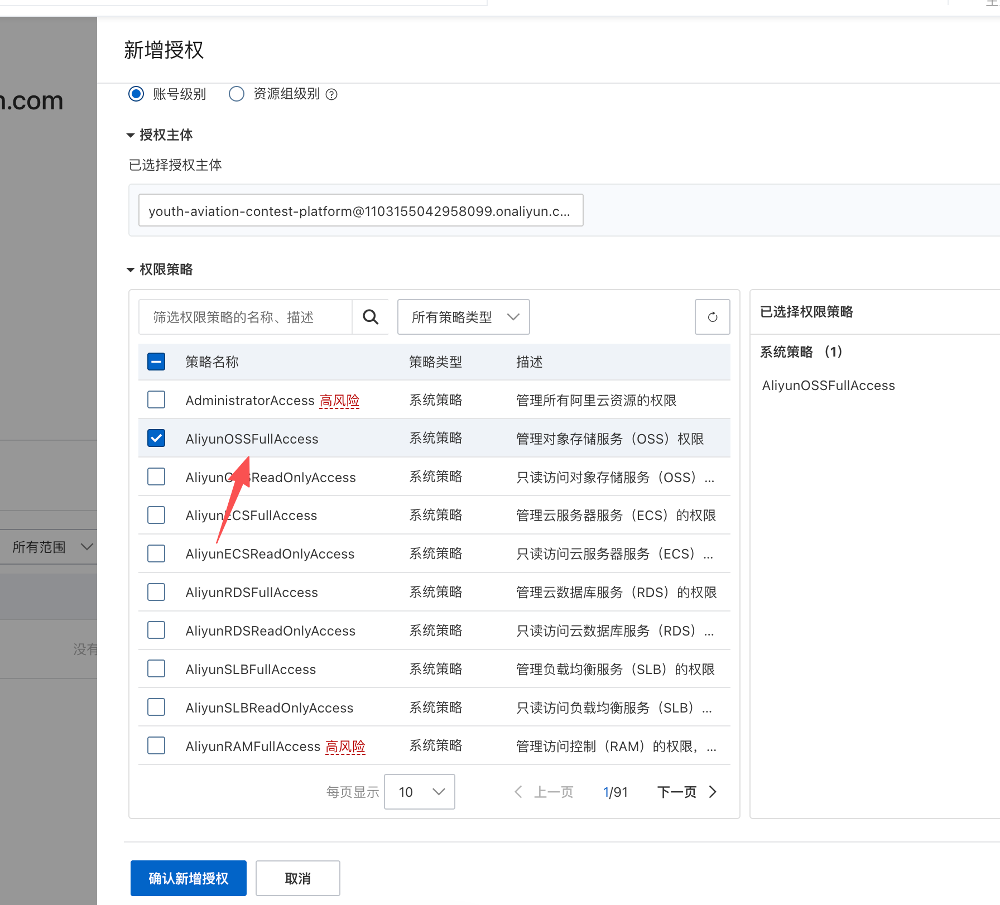

如果是快速演示环境，可以直接授予 `AliyunOSSFullAccess`。如果是正式环境，建议改为仅当前 Bucket 所需的最小权限。

### 4.4 配置 Bucket 跨域规则

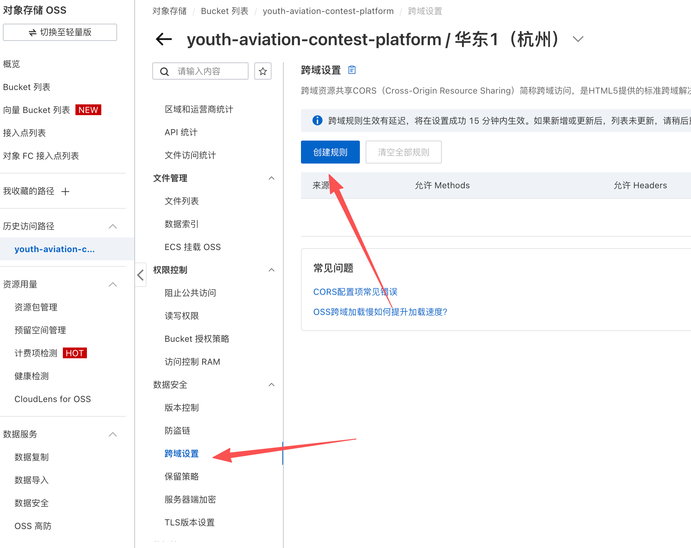

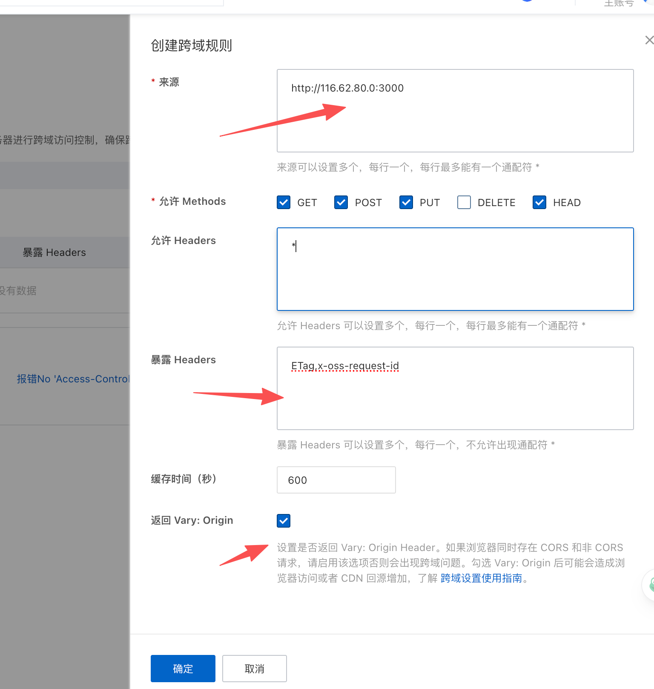

建议至少包含：

- 来源：你的正式访问域名，调试阶段也可临时加入 `http://ECS公网IP:3000`
- 方法：`PUT`、`GET`、`HEAD`
- Allowed Headers：`*`
- Expose Headers：`ETag,x-oss-request-id`

## 5. 登录 ECS 并部署项目

### 5.1 克隆代码

```bash
git clone https://github.com/duckduckii/youth-aviation-contest-platform.git
cd youth-aviation-contest-platform
```

### 5.2 准备生产环境变量

根目录已自带一份默认环境模板 `.env.production.default`。

如果你直接执行 `./deploy/release.sh`，脚本会在根目录缺少 `.env.production` 时自动生成一份，并自动填充随机的：

- `SESSION_SECRET`
- `DB_PASSWORD`
- `MYSQL_ROOT_PASSWORD`
- `REDIS_PASSWORD`

默认生成的是 `local` 存储配置，适合先把服务跑起来。

如果你要在首次发布前手动调整，也可以直接编辑根目录 `.env.production`。

至少需要替换以下字段：

- `STORAGE_DRIVER`
- `OSS_REGION`
- `OSS_BUCKET`
- `OSS_ACCESS_KEY_ID`
- `OSS_ACCESS_KEY_SECRET`
- `OSS_ENDPOINT`
- `OSS_INTERNAL_ENDPOINT`

一个可参考的 OSS 模式配置如下：

```env
HOST=0.0.0.0
PORT=3000
SESSION_SECRET=replace-with-a-long-random-string
SESSION_TTL=28800
SESSION_COOKIE_SECURE=false
TRUST_PROXY=false

DB_HOST=mysql
DB_PORT=3306
DB_USER=contest_app
DB_PASSWORD=change-this-db-password
DB_NAME=youth_aviation_contest
DB_CONNECTION_LIMIT=20
MYSQL_ROOT_PASSWORD=change-this-root-password

REDIS_URL=
REDIS_HOST=redis
REDIS_PORT=6379
REDIS_PASSWORD=change-this-redis-password
REDIS_DB=0
REDIS_PREFIX=youth-contest:sess:

STORAGE_DRIVER=oss
OSS_REGION=oss-cn-hangzhou
OSS_BUCKET=your-bucket-name
OSS_ACCESS_KEY_ID=your-access-key-id
OSS_ACCESS_KEY_SECRET=your-access-key-secret
OSS_ENDPOINT=https://oss-cn-hangzhou.aliyuncs.com
OSS_INTERNAL_ENDPOINT=https://oss-cn-hangzhou-internal.aliyuncs.com
OSS_PREFIX=contest
OSS_SIGNED_URL_EXPIRES=900
OSS_SECURE=true
OSS_CNAME=false

MAX_REPORT_MB=30
MAX_PROOF1_MB=30
MAX_PROOF2_MB=100
MAX_INTEGRITY_MB=30
```

补充说明：

- 如果前面挂了 Nginx 和 HTTPS，建议把 `SESSION_COOKIE_SECURE=true`
- 如果前面有 Nginx 或 SLB，建议把 `TRUST_PROXY=true`
- `local` 模式下，保留默认生成的本地存储配置即可

### 5.3 执行发布

```bash
chmod +x deploy/release.sh
./deploy/release.sh
```

脚本会依次完成：

1. 根目录缺少 `.env.production` 时，自动基于 `.env.production.default` 生成配置
2. 在 Ubuntu 上自动安装或修复 `Docker Engine` / `Docker Compose`
3. 应用宿主机 sysctl 参数
4. 安装或更新宿主机 `nginx` 并下发配置
5. 构建应用镜像
6. 启动 `mysql` 和 `redis`
7. 初始化数据库并写入演示账号
8. 启动应用容器

## 6. 访问测试

发布完成后先检查容器状态：

```bash
docker compose --env-file .env.production ps
docker compose --env-file .env.production logs -f app
```

再做健康检查：

```bash
curl http://127.0.0.1:3000/healthz
```

返回 `{"ok":true,...}` 说明应用已经启动。

如果你临时开放了 `3000` 端口，可以直接访问：

```text
http://ECS公网IP:3000
```

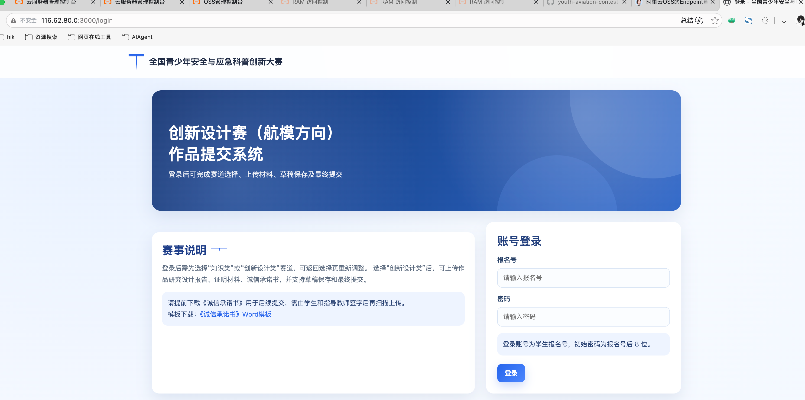

首次发布后会自动初始化以下测试账号：

- 学生账号范围：`202600010001` 到 `202600010100`
- 学生账号默认密码：报名号后 8 位
- 管理员账号：`admin / admin`
- 流程测试账号：`test / test`

## 7. 验证 ECS 与 OSS 是否走内网

先在 Bucket 概览中确认内网端点：

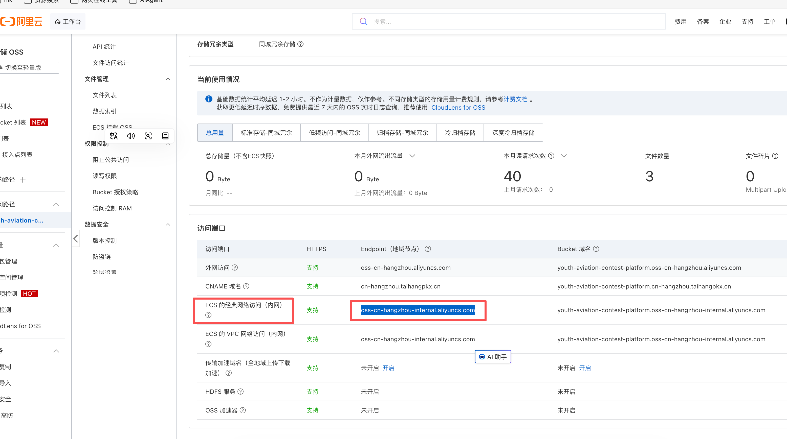

然后在 ECS 终端执行：

```bash
nslookup oss-cn-hangzhou-internal.aliyuncs.com
```

如果返回的是内网地址段，例如 `100.x.x.x`，通常表示 ECS 与 OSS 位于同地域，可走内网访问。

示例：

```text
Non-authoritative answer:
Name: oss-cn-hangzhou-internal.aliyuncs.com
Address: 100.118.28.43
Address: 100.118.28.52
```

## 8. 常用维护命令

```bash
docker compose --env-file .env.production ps
docker compose --env-file .env.production logs -f app
docker compose --env-file .env.production logs -f mysql
docker compose --env-file .env.production logs -f redis
```

代码更新后的重发版：

```bash
git pull
./deploy/release.sh
```

如果需要把外部访问切到标准 `80/443`，可继续参考 [ecs-single-node-docker.md](./ecs-single-node-docker.md) 里的 Nginx 反向代理配置。
